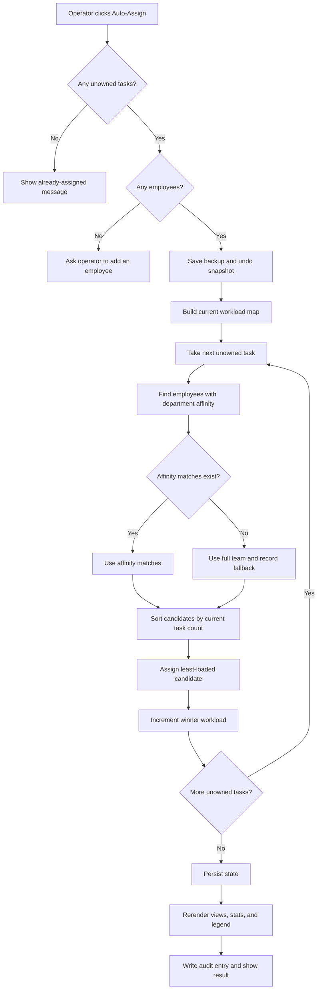

# Problem, Algorithm, Pseudocode, and Flowchart

## Problem

Small property-management teams often have software for transactions—leases, tickets, accounting—but still lack a simple answer to an operating question: **who owns every recurring responsibility across the company, and where is work at risk?**

The pain is organizational rather than purely technical:

- responsibilities are scattered across memory, spreadsheets, inboxes, and specialized tools;
- unowned work is difficult to see until it becomes urgent;
- adding a team member creates a manual assignment exercise;
- workload can become uneven even when every task has a name beside it;
- maintenance, tenant, vendor, and property context lives beside the responsibility map rather than inside it; and
- documenting the resulting operating model is extra work, so the documentation drifts.

PM Ops Map treats explicit ownership as the foundation. It ships a configurable starter map, makes gaps visible, supplies a simple assignment heuristic, persists the result locally, and exports the current model as portable data and an operations handbook.

## Constraints

The implementation is shaped by the following constraints:

1. **Static-first delivery.** The primary app must work from static hosting without a required backend.
2. **Local ownership of data.** Browser storage is the default; server transfer only occurs after Team Sync is enabled.
3. **No framework runtime.** The client is HTML, CSS, and browser-native ES modules.
4. **Editable starter data.** Users may rename tasks, so persisted state cannot rely only on the current visible name.
5. **Recoverable bulk operations.** Auto-assignment, imports, and sync replacement need backup or undo paths.
6. **Explainable assignment.** Operators should be able to understand why a task went to a person.
7. **Graceful incompleteness.** A team may not define affinities for every department.
8. **Small-team sync semantics.** Remote collaboration must detect stale writes without pretending to perform field-level merging.

## Inputs and outputs

### Application input

| Input | Source | Used for |
|---|---|---|
| Department and task template | `config.json` → `orgData` | Initial operating map |
| Default affinities and colors | `config.json` | Starter team presentation and matching |
| Saved browser records | `localStorage` via `js/storage.js` | Returning-user state |
| User interactions | Forms, buttons, filters, inline edits | State transitions |
| Imported workspace | JSON or clipboard via `js/io.js` | Portable restoration/transfer |
| Optional remote snapshot | Team Sync via `js/sync.js` | Shared workspace state |

### Application output

| Output | Destination |
|---|---|
| Interactive responsibility, map, team, work-order, and portfolio views | Browser DOM |
| Saved task/team/work-order/portfolio/audit state | Browser `localStorage` |
| Recovery snapshots | Rolling browser backup list |
| Workspace data | JSON and CSV downloads or clipboard |
| Operating documentation | Markdown and printable HTML handbook |
| Optional shared snapshot | File-backed sync workspace |

## Core algorithm: affinity-first balanced assignment

The repository’s clearest business algorithm is [`runAutoAssign`](../../js/views/team.js). It assigns only tasks whose owner is `UNOWNED`; existing assignments are preserved.

For each unowned task:

1. select employees who list the task’s department as an affinity;
2. if that candidate set is empty, fall back to the full team;
3. sort candidates by their current number of assigned tasks;
4. choose the least-loaded candidate;
5. assign the task; and
6. increment the winner’s workload before considering the next task.

Updating the workload immediately matters. Without it, a batch could repeatedly choose the person who was least loaded only at the beginning of the run.

### Complexity

Let:

- `T` be the number of tasks,
- `U` be the number of unowned tasks, and
- `E` be the number of employees.

`buildWorkloadMap` scans the team and tasks, approximately `O(E + T)`. Each unowned task filters employees and sorts at most `E` candidates, so assignment is `O(U × E log E)`. With the repository’s intended small-team scale, the clarity of sorting is more valuable than introducing a heap or a more complex scheduler.

### What the heuristic does not optimize

It does not claim to measure hours, task difficulty, employee capacity, calendars, priority, deadlines, licensing, geography, or fairness over time. A “load” is the count of currently assigned responsibilities. Equal-load ties keep JavaScript’s stable input order, so employee order can influence tied results.

These limits are appropriate for an explainable starter workflow, but a production staffing engine would need richer capacity and eligibility inputs.

## Pseudocode

```text
FUNCTION autoAssign(departments, employees):
    unownedCount = count tasks where owner is UNOWNED

    IF unownedCount is 0:
        report "already assigned"
        RETURN

    IF employees is empty:
        report "add an employee first"
        RETURN

    save recovery backup
    save one-step undo snapshot
    workload = count assigned tasks per employee
    fallbackDepartments = empty list
    assignedCount = 0

    FOR EACH department IN departments:
        FOR EACH task IN department.tasks:
            IF task.owner is not UNOWNED:
                CONTINUE

            candidates = employees whose affinities include department.id

            IF candidates is empty:
                candidates = copy of all employees
                remember department as a fallback

            sort candidates by workload ascending
            winner = first candidate

            IF winner exists:
                task.owner = winner.name
                workload[winner.name] = workload[winner.name] + 1
                assignedCount = assignedCount + 1

    persist task state
    redraw affected views and counters
    append audit event
    report assigned count and affinity fallbacks
END FUNCTION
```

## Flowchart



## Supporting algorithm: startup and state reconciliation

Auto-assignment only works because the app first reconciles three layers of state:

1. [`config.json`](../../config.json) defines the current supported departments and starter tasks.
2. [`js/app.js`](../../js/app.js) stamps every task with its original name as `_configName` and guarantees a permanent `id` (`js/taskIdentity.js`).
3. [`js/storage.js`](../../js/storage.js) overlays compatible saved fields onto those current task objects.

That approach avoids blindly trusting an old serialized copy of the entire configuration. New code can ship updated display structure while compatible user edits are restored by stable task identity.

```text
FUNCTION startApplication(config, browserStorage):
    set shared org/team color configuration

    FOR EACH configured task:
        task._configName = task.name
        task.id = task.id or deterministic fallback

    load team, work orders, portfolio, and audit log

    FOR EACH saved department that still exists:
        FOR EACH saved task:
            match current task by saved id, else _configName / alias
            IF matched:
                copy bounded, valid editable fields

    render all initial surfaces from reconciled shared state
    show onboarding only when company profile is absent
    initialize notifications and optional sync
END FUNCTION
```

## Supporting algorithm: optimistic Team Sync

Team Sync serializes the workspace and remembers both the last synchronized snapshot and server version.

- If the current snapshot differs, the client pushes with `expectedVersion`.
- The server accepts only the current version, increments it, and writes the new record.
- If the version is stale, the server returns `409` and includes current remote state.
- The client validates that state and asks the operator to resolve the whole-snapshot conflict.
- If the client is clean, it checks the remote version and pulls only when remote data is newer.

The server also queues writes per workspace in [`WorkspaceStore._withLock`](../../server/src/store.js), preventing two in-process writes from interleaving their read-modify-write sequence.

This is optimistic concurrency with human-reviewed snapshot replacement, not collaborative field merging.

## How the implementation maps to the code

| Concern | Implementation |
|---|---|
| Starter responsibilities | `config.json` (`orgData.departments`) |
| Shared live objects and workload calculation | `js/state.js` (`buildWorkloadMap`, `countUnowned`) |
| Stable task identity and startup | `js/app.js` (`bootstrapWithConfig`, `initApp`) |
| Affinity-first assignment | `js/views/team.js` (`runAutoAssign`) |
| Browser persistence and recovery | `js/storage.js` (`saveToStorage`, `loadFromStorage`, backup functions) |
| Undo and portable import/export | `js/io.js` |
| Compatibility report | `js/stateSchema.js` (`validateImportedState`) |
| Client sync decision loop | `js/sync.js` (`runSyncTick`, `pushTick`, `pullIfNewerTick`) |
| Version-checked HTTP contract | `server/src/app.js` |
| Passphrase verification and serialized writes | `server/src/store.js` (`push`, `_withLock`) |
| Behavior verification | `js/__tests__/` and `server/__tests__/` |

## Production-hardening path

To move from a strong portfolio/small-team build toward production use, the next algorithmic steps would be:

1. define effort, capacity, eligibility, and availability rather than treating every responsibility as equal;
2. make tie-breaking explicit and test assignment invariants;
3. store immutable IDs in source data instead of deriving task identity from the original name;
4. introduce authenticated users and role-scoped workspaces;
5. replace file persistence with transactional storage and cross-instance concurrency controls;
6. implement field-level conflict resolution or an append-only change model; and
7. add integration/end-to-end coverage for browser workflows, not only pure utilities and server APIs.
